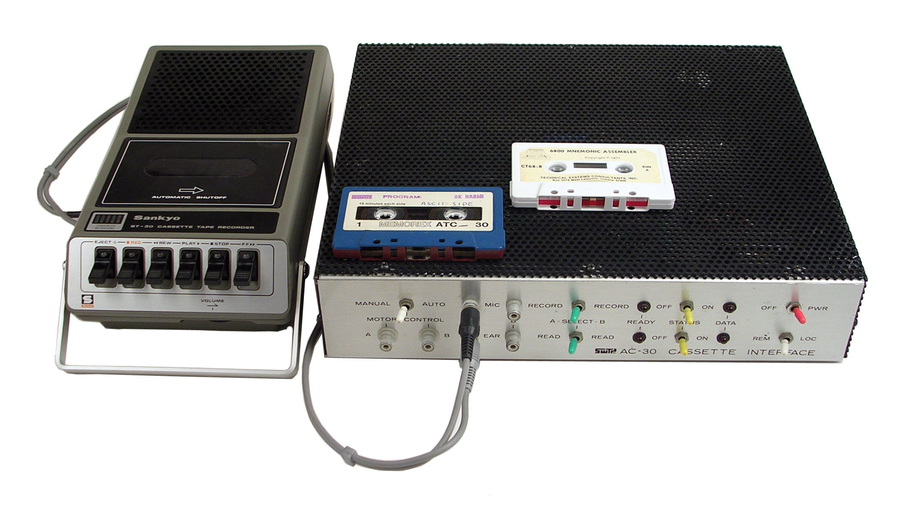
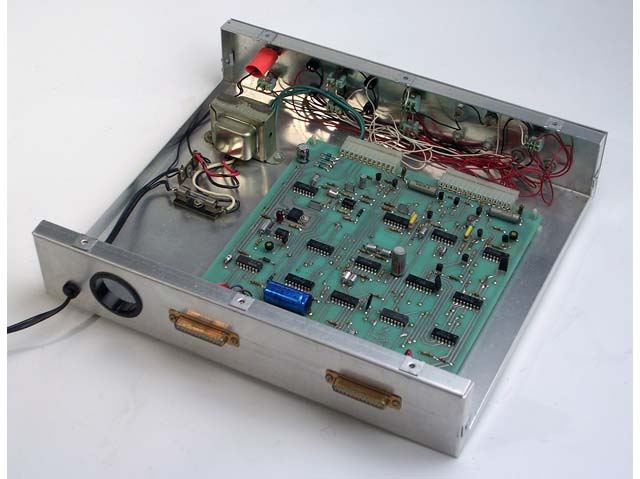
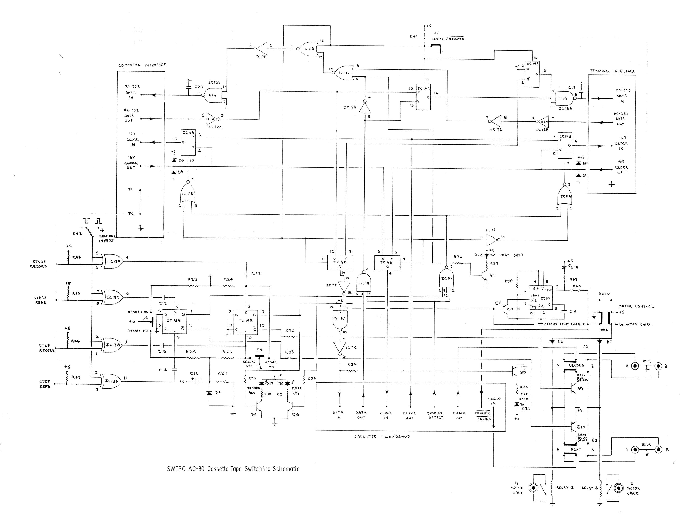
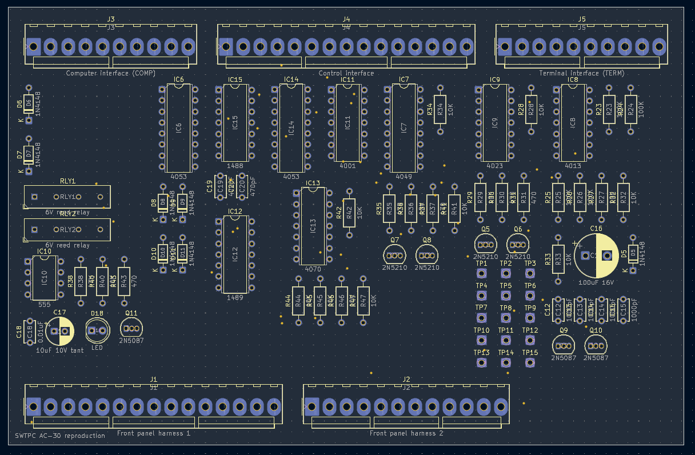
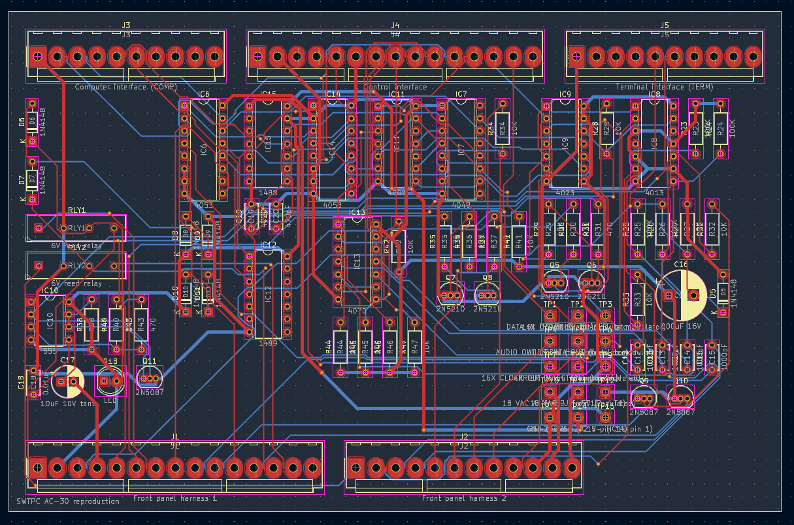

# SWTPC AC30 Reporduction
A reproduction SWTPC AC-30 Cassette Interface

## Description

I have a couple of Motorola MC6800, MC6802, and MC6809 machines from the 1970's. And I wanted to
setup a typical cassette plater/recorder setup to save and load code written on these machines.

**Note:** 2026/10/08 - This is my go around with Claude, Kicad and FreeCAD and creating a PCB to be sent off as gerbers. I have a lot of inspecting to do. But for a 1st go this is scary impressive.

## Claude created Kicad files

I gave Claude the following prompts:

```text
Create a kicad schematic for docs/AC30-BOM.md docs/ac30_schematica.jpg
```

and


```text
Save what you have but provide solder pads and labels for the missing power and mod/demod
```

and


```text
Now create the pcb from the schematics. Minimize the board size but leave a safe boarder along the edge.
```

After this I use a few suggested prompts.

Here's what the inside of the Original SWTPC AC30:



I'd estimate the board to be about 9" x 9" (inches) in size. Here's the schematics I gave it:



I gave it the AC30-BOM.md file (simple markdown text file).

It started churning and created a 'schematic' (doesn't look like the above, hard to read) and I imported it into the PCB editor. Then didn't make any changes. Instead I let Claude do the rerouting.

I then found out I needed to upgrade Kicad to 10.7 and FreeCAD 26.3 so Claude could create Python 3.11 scripts to build a schematic, the PCB and routing. That was messy as I have Debian Trixie and the latest wants Debian Forky. Anyway, this is the final 1st round attempt. More cleanup to do yet before I ship off the gerbers.

I'd estimate the size of the new PCB to be about 3.5" x 7" (inches).





## Credits

I stole this from [Deramp's AC30 (Mike)](https://www.swtpc.com/mholley/ac30/ac30_index.html) site.
And he saved it from Mike Holley's original SWTPC site.

## Links

- [Deramp's AC30 page](https://www.swtpc.com/mholley/ac30/ac30_index.html)
